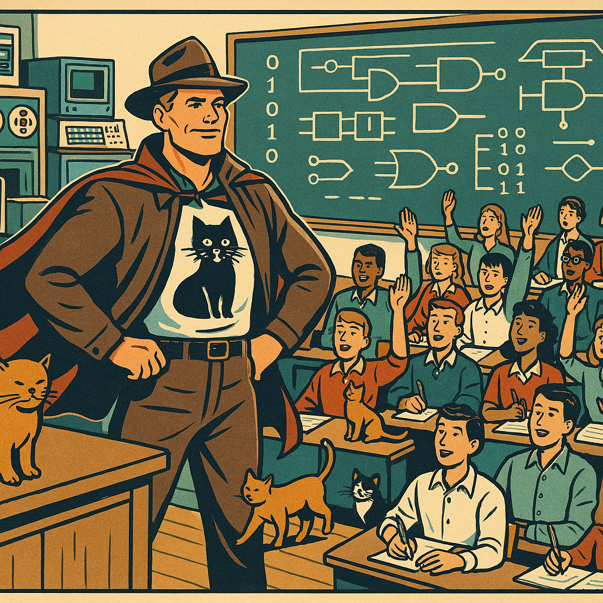

# toreaurstadboss.github.io

_Github pages repo for Tore Aurstad (GitHub username : @toreaurstadboss)_

## Web link to Github Pages - Tore Aurstad

https://toreaurstadboss.github.io/

## Welcome to my lectures!

### Choose a lecture!

* [Lecture 1 - Programmatic MCP Demo](lectures/lecture1/ProgrammaticMcpDemo.md)
* [Lecture 2 - ApiResult Monad with C# 15 Union Types](lectures/lecture2/ApiResultMonad.md)

