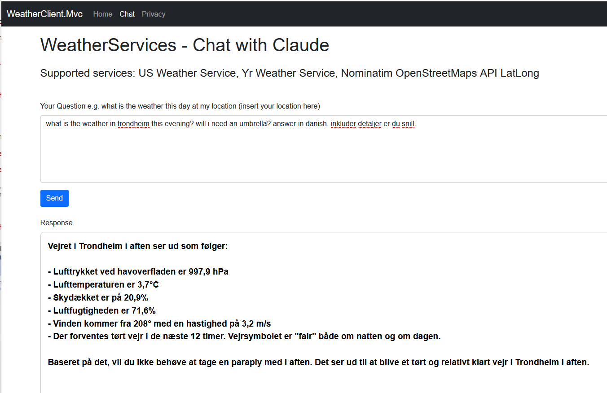
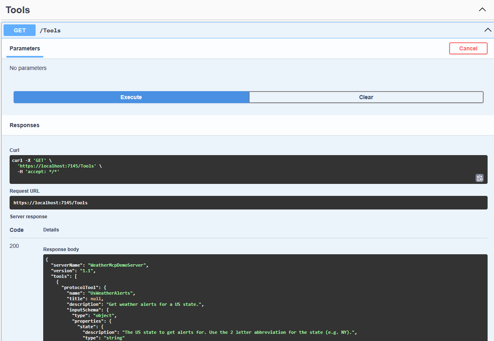

# Programmatic MCP Demo

### MCP Architecture — Systems View

MCP is a standardized interface that enables AI applications to interact with a wide variety of data sources and tools in a consistent way. The architecture can be visualized as a layered graph, where the middle layer is the MCP protocol, connecting AI applications on one side and data sources/tools on the other.

%%{init: {'theme': 'base', 'themeVariables': {'clusterBkg': '#e1f5fe11', 'fontSize': '16px'}}}%%
graph TD
    subgraph AI_Applications ["<big><b>AI Applications & Interfaces</b></big>  "]
        direction TB
        A1["<b>Chat Interfaces</b> (Windows Copilot, ChatGPT, Claude)"]
        A2["<b>IDEs & Code Editors</b> (VS Code, Visual Studio, Cursor)"]
        A3["<b>Custom .NET AI Apps</b> (Semantic Kernel, .NET SDKs)"]
    end

    subgraph Protocol_Layer ["<big><b>Middle Layer</b></big> "]
        MCP{{"<b>● Model Context Protocol ●</b> (Standardized Interface)"}}
    end

    subgraph Data_Tools ["<big><b>Data Sources & Tools</b></big>  "]
        direction TB
        D1["<b>File System</b> (Windows File I/O, UNC Shares, OneDrive)"]
        D2["<b>Databases</b> (SQL Server, Azure SQL, SQLite)"]
        D3["<b>Microsoft Cloud APIs</b> (MS Graph, SharePoint, Azure Blob Storage)"]
        D4["<b>REST & Web APIs</b> (GitHub, OpenWeather, Custom HTTP Services)"]
        D5["<b>Windows System APIs</b> (WMI, Registry, Event Log, PowerShell)"]
    end

    %% Bidirectional Relationships
    AI_Applications <==> MCP
    MCP <==> Data_Tools

    %% Styling
    style MCP fill:#00FF00,stroke:#333,stroke-width:4px
    style AI_Applications fill:#e1f5fe,stroke:#01579b
    style Data_Tools fill:#fff3e0,stroke:#e65100

    caption[Source: Derived and tailored for .NET and Windows technology from diagram at modelcontextprotocol.io / Created by Tore Aurstad]

---

## Key-takeaway : MCP is also both a contract and a protocol

It is important to limit of what a LLM can reach and define a contract that defines which tools, (data) resources and other capabilities that a LLM can access. 

MCP is both a protocol and contract that defines how AI applications can request and receive data from various sources. It abstracts away the complexities of different APIs and data formats, allowing developers to focus on building AI applications without worrying about the underlying data access.

## The MCP Demo : Yr weather service using Model Context Protcol 

The demo is a simple weather service that uses Yr web services to provide weather information. 

**What we will build**

The demo is a web application where you can ask about the weather at a given place and get the response which will use a tool that uses Yr web services to get weather information. The demo demonstrates using MCP tools. **Tools** is a category of capabilities that are offered in the MCP protocol.

Server features that are offered with MCP are : 
* Tools : Executable functions that allow models to perform actions or retrieve information 
* Resources : Structured data or content that provides additional context to the model 
* Prompts : Predefined templates or instructions that guide language model interactions

The screenshot below shows the Demo in action, where I ask abou thte weather in Trondheim tonight. I specify it to include deatils also. 

As we see, we can ask where free-form about the weather the AI LLM model which makes it possible to have a more natural converation about the weather than just using a website to look up the weather. 

Example of a more advanced demo would be :
We could have combined this for example with Synthesized Text to Speech voice assistant and Speec to Text to have a natural conversation with the AI model.

### Screenshot of the demo 

The demo here focuses on *Tools*. 

Yr is a popular weather service in Norway delievered by Norwegian Metereological Institute (met.no) in Oslo, Norway. 

In the same demo repo, you find code how you can expose metadat about the tools the MCP offers. 

We can with for example Swagger present metadata information about the tools that are offered in the MCP protocol. This is a good way to present the contract of the MCP protocol and what capabilities it offers.

### Github repo for the MCP Weather Demo
The Github repo is public available here for those who want to explore the code and try it out themselves : 

https://github.com/toreaurstadboss/WeatherMCPDemo

Note that to run the demo, you must have an account at Anthropic web site and set up an API key here:

https://console.anthropic.com/dashboard

To just test out Anthropic, it is not expensive. I paid them 20 dollars a year ago and still have about 5 dollars left on the account of mine. And this includes a lot of testing and playing around using the Anthropic Claude service.

The model I have been using while testing is _claude-3-haiku-20240307_ , it is some months since I worke dwith the demo and therefore **newer Claude** models should be possible to test out here. 

### Serverside of the MCP Demo - WeatherServer.Web.Http 

First off, I have used the following Nuget's. Note that you pr

