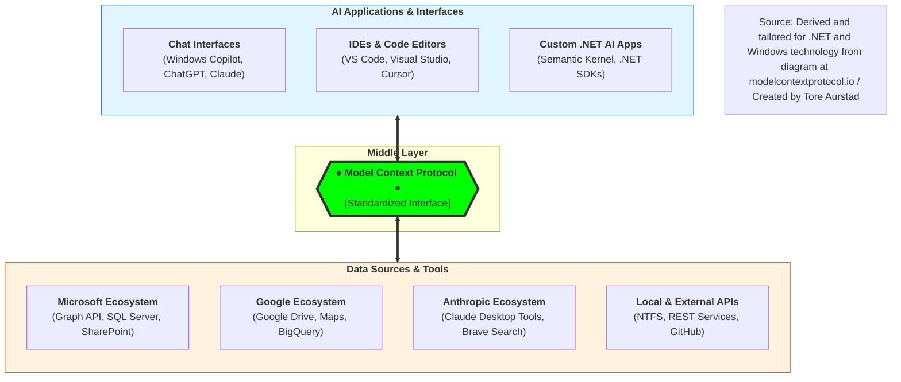

# Programmatic MCP Demo

### MCP Architecture — Systems View

MCP is a standardized interface that enables AI applications to interact with a wide variety of data sources and tools in a consistent way. The architecture can be visualized as a layered graph, where the middle layer is the MCP protocol, connecting AI applications on one side and data sources/tools on the other.

---

## Key-takeaway : MCP is also both a contract and a protocol

It is important to limit of what a LLM can reach and define a contract that defines which tools, (data) resources and other capabilities that a LLM can access. 

MCP is both a protocol and contract that defines how AI applications can request and receive data from various sources. It abstracts away the complexities of different APIs and data formats, allowing developers to focus on building AI applications without worrying about the underlying data access.

